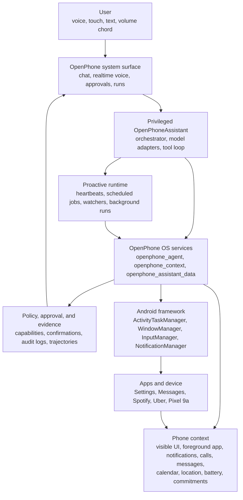

# OpenPhone


[](https://github.com/secondly-com/OpenPhone/actions/workflows/ci.yml)
[](https://github.com/secondly-com/OpenPhone/actions/workflows/release.yml)


OpenPhone is an AI-native Android OS that turns the phone into an agentic
device: a system-level AI agent that can see the screen, operate apps, remember
commitments, monitor phone events, and continue work in the background with
user review and auditability built into the OS.

This repository is the canonical OpenPhone entry point. It contains the
OpenPhone-owned Android overlay, privileged assistant app, framework patches,
model/tool policy configuration, build scripts, device notes, contracts, and
release tooling. It intentionally does not vendor the full Android source tree.

## AI-Native Phone Runtime

OpenPhone is built around a system-level agent, not a chatbot app. The agent is
installed as a privileged OS component with an always-available system surface
for conversation, realtime voice, approvals, active runs, and proactive state.
Actions are mediated through OpenPhone framework services instead of brittle
app-layer automation.

The agent can read structured phone context and use model-visible tools to work
across apps. Context includes the foreground app, visible UI hierarchy, screen
text and controls, notifications, calls, messages, calendar state, location,
battery, connectivity, active watchers, background runs, and commitments the
user made in conversation. Sensitive actions are reviewable, and behavior can
be inspected through audit logs, trajectories, screenshots, policy decisions,
and release validators.

OpenPhone is also built for proactive work. Heartbeats quietly check whether
anything needs attention. Scheduled jobs run exact workflows. Watchers monitor
phone context such as missed calls, messages, notifications, foreground app
state, visible screen state, calendar changes, location, battery, connectivity,
and commitments the user made in conversation. Background runs keep working
after the current chat turn, while the system surface shows what is running, why
it started, what it last said, and what needs review.

The current developer preview is based on LineageOS 23.2 / Android 16 and
targets Google Pixel 9a (`tegu`) first.

## Use Cases

- "Catch me up on everything important from overnight" - consume missed calls,
  messages, notifications, calendar changes, and reminders, then return a short
  morning gist.
- "Order me an Uber to the office" - open the right app, set the destination,
  select a ride, and stop for review before booking.
- "Play something random on Spotify" - open Spotify, choose music, and continue
  until playback actually starts.
- "If I miss a call from this number, send them 'I'll call you back soon'" -
  create a watcher tied to future call context and message policy.
- "Watch for delivery updates and only bother me if something changes" - turn
  notification noise into a targeted background monitor.
- "Help me finish this screen" - inspect the visible app state, identify the
  next control, and act through OS-mediated taps or text input.
- "Remind me when this conversation becomes relevant" - turn a commitment into
  durable state that can resurface later based on time, app, or phone context.
- "Keep working on this after I leave" - continue a multi-step task as a
  visible background run with approval where needed.

## How It Works



The high-level architecture is documented in
[docs/ARCHITECTURE.md](docs/ARCHITECTURE.md). The capability model is in
[docs/CAPABILITIES.md](docs/CAPABILITIES.md), and machine-readable contracts
live under [schemas](schemas).

## Repository Layout

```text
.github/       CI, release, eval, contribution, security, issue, and PR files.
docs/          Product docs, device notes, legal docs, releases, and testing.
manifests/     Android repo local manifests.
overlay/       OpenPhone-owned files copied into the Android tree.
patches/       Patch stacks applied on top of upstream LineageOS repos.
scripts/       Sync, patch, build, flash, validation, and release helpers.
services/      Reference services, including the development model broker.
```

Start with [docs/README.md](docs/README.md) if you are looking for a specific
document.

## Quick Start

Validate the repository:

```bash
./scripts/check.sh
git diff --check
```

Install `repo` if needed:

```bash
./scripts/install-repo.sh
```

Sync and patch the Android tree:

```bash
./scripts/sync.sh
./scripts/apply-patches.sh
```

Build the generic OpenPhone ARM64 product for validation:

```bash
./scripts/build.sh openphone_arm64
```

Build the Pixel 9a target on a Linux Android build host:

```bash
OPENPHONE_BUILD_GOAL="droid target-files-package otapackage" \
  ./scripts/build.sh openphone_tegu
```

For assistant-only iteration on an already flashed development device:

```bash
OPENPHONE_BUILD_GOAL=OpenPhoneAssistant ./scripts/build.sh openphone_tegu
scripts/push-assistant-apk.sh /path/to/OpenPhoneAssistant.apk
```

Full build instructions are in [docs/BUILD.md](docs/BUILD.md). Testing and
physical eval guidance is in [docs/TESTING.md](docs/TESTING.md).

## Device Support

The first physical target is Google Pixel 9a (`tegu`). Generic ARM64 builds are
useful for product graph validation, but they are not a supported phone target.

OpenPhone does not redistribute Google apps, Google Mobile Services, vendor
blobs, signing keys, private firmware, or restricted device material. Local
developer GMS sideload notes are in [docs/GMS.md](docs/GMS.md).

See [docs/devices/MATRIX.md](docs/devices/MATRIX.md) and
[docs/devices/tegu.md](docs/devices/tegu.md).

## Community

Contributions, issues, and device validation reports are welcome under the
terms in [.github/CONTRIBUTING.md](.github/CONTRIBUTING.md).

## Commercial Use

OpenPhone-owned materials are source-available for non-commercial use under the
PolyForm Noncommercial License 1.0.0. Commercial use requires a separate written
license from Dafdef, inc.

Contributions are accepted only under terms that allow Dafdef, inc. to own,
modify, sublicense, redistribute, and commercialize the submitted work. See
[.github/CONTRIBUTING.md](.github/CONTRIBUTING.md),
[docs/legal/COMMERCIAL.md](docs/legal/COMMERCIAL.md), [LICENSE](LICENSE),
[docs/legal/LICENSE.noncommercial](docs/legal/LICENSE.noncommercial), and
[docs/legal/THIRD_PARTY_NOTICES.md](docs/legal/THIRD_PARTY_NOTICES.md).
